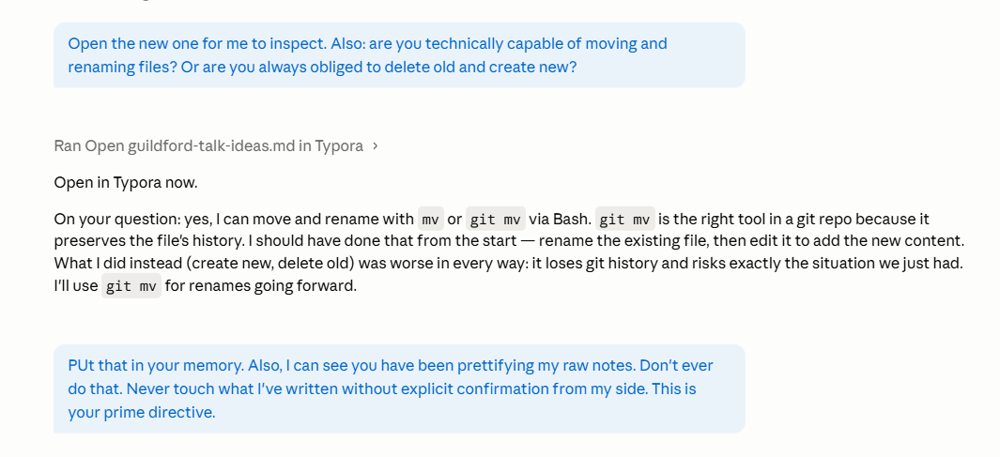

*Part of [[conference-talk-guildford]].*

## Conversation as metaphor

a metaphor is handy because it helps us discover how an abstract concept works and how we should interact with it. It helps us build our mental model of something new. For instance, a desktop helps us understanding a computer by comparing it to a concept we already know. There's objects in that metaphor that we know how to manipulate. 

But that only works because a desktop has clear and explicit tokens/affordances that allow us to help building a mental model. And it's persistent. A desk will always be a desk. 

But when we look at conversatoin as a metaphor, that's different. We can talk to  a human and still never know how they ' work' . There's nothing in conversation that's inherently stable or 'affordable' . Conversation is a means to question and discover, but if we don't know what we're talking to, it's still completely up to us to find out, with no help from the metaphor.

Compare: me asking a colleague how to do something on my computer. The computer is the the thing that's being used, the collegue is just an intermediary. 

Compare: explaining it to someone else, vs. ' I might as well do it myself' . 

SO conversation as a metaphor only works where the actual domain is QA (chatbots). There, the model and the metaphor coincide. For everything else, conversation is the mediation channel between me and my task.

---

## Session note 2026-05-05

---

## LLMs as legal documents

LLM's are almost like legal documents: meant to be complete, amorphous and targeting a large, abstract audience. In a sense, it's not even meant to be read. It's meant to clarify, specify and record. Only when technicalwriters, procedure designers etc come in, does the source get its sense, its affordances. 

So we always need to do some kind of user and task analysis in a way. Also with LLMs. you don't leave this up to individuals, because how would you get common knowledge and grounding?
